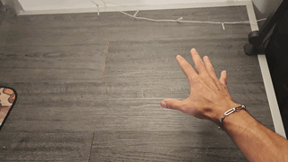
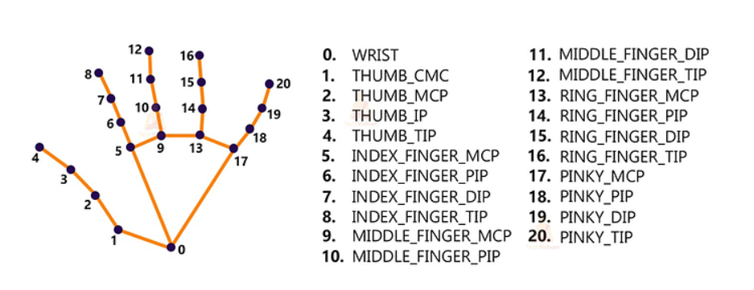
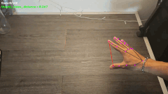
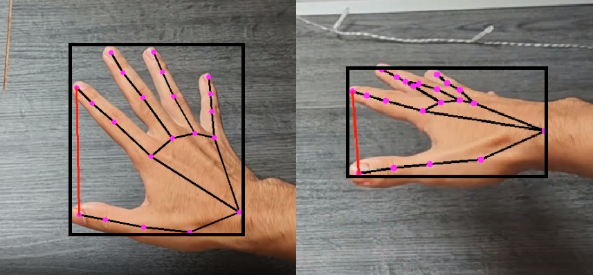
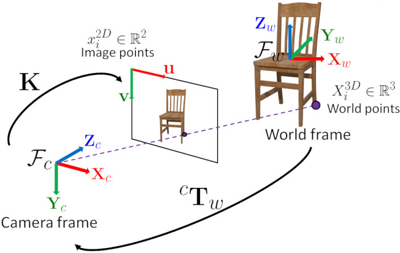
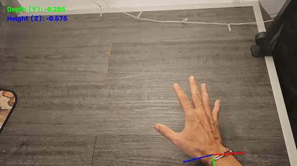
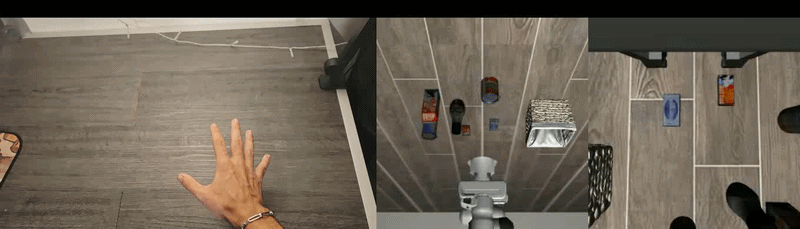

# Training a VLA model to move a robotic arm with my own hands (literally)

In this project, I fine-tuned a VLA model using my own collection of videos and instructions (like "move left" or "rotate clockwise") with the objective of manipulating a robotic arm on customs instructions that I created, with my hand as a the teacher.

## How it began

My background as a researcher is in reinforcement learning, and naturally, I've always kept up with the current advancements in the domain, being the most interesting one to me VLAs. I feel like this technology, besides the wonders of an LLM, is the first actual 'sci-fi'-esque technology that will allow a computer to come to life and produce general-purpose machines.

Thing is, I've never built one, between finishing my Master's and working as a researcher, [Humanoid's](https://thehumanoid.ai/) provided me with the perfect environment to experiment and learn a bit more about this. Their challenge was to drive a robotic arm in a simulation env, and he main constraint was for us to use data that was collected by ourselves to do so. Time to get to work.

### The Plan

The idea behind what I will be doing is simple:
1. Create a set of simple instructions of things I want to make the robotic arm do.
2. Record myself doing it with my hand.
3. Convert hand into robot actions.
4. Replay what my hand did, this time on the simulator.
5. Fine-tune a VLA model with this data.

## Data Collection

This was the most straight-forward part of the project (at least the collection itself, we'll get to that). After some iterations of what I wanted to train on, I collected approximatedly 30 videos of me doing 9 different actions, slightly changing initial conditions to add some variety, you can see the data in [HuggingFace](https://huggingface.co/datasets/ReAscalon/humanoid_move_thing).

Some instructions include:
- Opening and closing the gripper;
- Rotating clockwise and counterclockwise;
- Moving in all directions;
- Holding stil;

Observe some clapping:

In total, I got approximatedly 10 videos for each instruction, to a total of 89 clips of 5-15 seconds.

## Hand Tracking

The example on the original post used AprilTags as a visual landmark to align the simulation and the video fields, allowing us to easily calculate the relative positions between the camera and the robotic arm.

As I though about the challenges behind embodied AI, I deliberatedly chose to not use any kind of field alignment technique, and instead derive everything I needed from the environment itself (specifically, my own hand as the reference). This, of course, comes with a huge challenge, which no questions asked, was the biggest hurdle that I faced when developing this idea.

### Converting video to numbers

With these videos in hand (ha!), now I'd have to convert whatever my hand was doing into some useful data. After some research, [MediaPipe](https://developers.google.com/edge/mediapipe/solutions/vision/hand_landmarker), a library made specifically for image recognition, allowed us to collect positional information on 21 landmarks throughout our hand and wrist, as seen here:

And after a bit of trial and error, I got this going:

Fantastic. Note the line connecting the thumb and index, this will be the main way of indicating if I am gripping something or not, and here is where the biggest challenge began.

### Going forwards, and going upwards

Going from 2D video to 3D motion is quite hard, in the end we are operating with one dimension less than we need. Pixels move in two axes on a 2D video, and this does not provide us with any sense of depth, so moving my hand forwards produces the same change as rising it, a positive change in the Y axis, making 3D movement ambiguous in that scenario.

Going back to the original example, the use of AprilTags in the table allows us to calculate the geometry that locates the camera position relative to the table, and from here we can calculate coordinates and motion analytically through the change in video in relation to the camera position. And again, my objective was to do this without these markers, the challenge gave a lot of focus on data, so I wanted data to be my main concern.

My first instinct was to use MediaPipe's provided depth estimation, and after trying it for a while and seeing what kind of data it produced, I abandoned it, it was failing to distinguish between Y movement and Z movement. So, I tried to use my hand as a scale.

By making some assumptions in my hand size, I could use the distance between landmarks as a method to estimate depth, if my hand gets smaller, the landmarks get closer, which means the hand is further away. It did indeed work, now movement was being considerably better in terms of distinguishing both axes, but still nowhere near optimal. The problem in this approach wasn't all that opaque either, as hand position and perspective plays a huge role in this kind of calculations:

## The stroke of genius

So I had to search for something a bit more intricate, and that's when I read about Perspective-n-Point (PnP).

Normally, PnP is used to estimate a camera's position using a set of known 3D points, and their corresponding 2D projections, and this is really how AprilTags work in the end, we know the physical size of the tag and where their corners sit, and we have their 2D video projections, so we can estimate the camera position.

But, if we look at what we need to solve this problem, we actually (kinda) have everything we need to solve for it. Our hands, in terms of scale, do not really change all that much, and the palm specifically can't bend like our fingers, the palm is a rigid body, and we can estimate roughly their 3D positions (if we assume the palm landmarks are all coplanar to each other).

So, instead of calculating the relative position of the camera to our palm, we instead calculate the relative position of the palm to our camera!

This did work! And honestly in a much better way than I was expecting. As seen in the gif the axes are a bit crooked, in the end I assume the palm to be a plane, and this would be a limitation as any task requiring twisting my hand would throw this off, but for a hand serving as a proxy of a robotic arm, this will suffice.

### Preparing our data

Now that we can convert 2D video to hand positions, we will make use of the change in position of my hand to produce data, so my hand movement will be expressed as [dx, dy, dz, drx, dry, drz, gripper].

As I am human and as calculations go, the data had a lot of jitter, and when I looked at the initial retargetings inside the simulator, the robotic arm shaked a lot, and this would introduce a lot of problems in terms of precision if I were to train the VLA on larger tasks where precision was key. So, across all the data, I computed an EMA to smooth everything out.

Another important change was calculating the hand position in relation to the camera angle, so by using an approximation of how tilted the camera was, we could calculate the rotation matrix to align our data coordinates to the coordinates of the simulator (aligned in relation to the table).

In terms of the gripper, initially I looked rougly at what would be decent values to delineate if my thumb-index distance meant opened or closed, but this was very unstable, so I opted to calculate a kmeans per video to find a decent threshold between setting the gripper as opened or closed. In hindsight, I assumed the gripper to be binary, which led me to try and find the threshold in the continuous data, when I could've just map the max and min of each clip to [-1, 1] respectively.

Finally, now we just had to convert this data into LIBERO's convention, which was very straightforward and just required some scaling.

With this, we have hand movement being decently translated into the simulation environment. Running this over my whole set of videos, and associating each one to their specific instruction, we end up with our dataset to train the VLA on.

## Training

In terms of training, given our constraints in terms of data, and the fact that I have less than a week to train, and that my PC has only 6GB of VRAM, I couldn't neither train a whole new VLA model, nor run a full fine-tune on SmolVLA. With this in mind, I set my goal on at least optimizing SmolVLA through LoRA. This would take a small toll of roughly 2GB of VRAM on my computer and run relatively fast approximatedly 6 hours per 30000 steps. Given my time and compute constraints, I'll expect a trade-off in terms of results to at least get some results.

## Results

(Ran 3 per instruction ove 100 steps averaged each column explain later)

### BASELINE
| instruction      | Δx   | Δy   | Δz   | abs. path | rY     | gR     | sY | sZ | sG |
| ---------------- | ------- | ------- | ------- | ------ | ------ | ------ | -- | -- | -- |
| move left        | +0.1304 | +0.0537 | -0.0177 | 0.3556 | 0.0703 | 0.0642 | 7  | 10 | 7  |
| move right       | +0.2407 | -0.0998 | +0.0904 | 0.4022 | 0.1228 | 0.0387 | 4  | 7  | 6  |
| move forward     | +0.2303 | +0.0025 | +0.1214 | 0.3913 | 0.0760 | 0.0384 | 5  | 5  | 7  |
| move backward    | +0.1371 | +0.0705 | +0.1242 | 0.3493 | 0.0840 | 0.0544 | 5  | 5  | 7  |
| clockwise        | +0.0786 | +0.0914 | -0.0377 | 0.3905 | 0.0942 | 0.0768 | 2  | 6  | 8  |
| counterclockwise | +0.0963 | +0.0834 | -0.1128 | 0.3685 | 0.0913 | 0.0762 | 2  | 6  | 7  |
| wave             | +0.2707 | -0.0514 | +0.1194 | 0.4440 | 0.0771 | 0.0376 | 4  | 9  | 3  |
| clap             | -0.0365 | -0.1704 | -0.0548 | 0.3562 | 0.1949 | 0.0376 | 1  | 6  | 1  |
| hold still       | +0.2086 | +0.0191 | -0.0302 | 0.4085 | 0.0972 | 0.0697 | 5  | 10 | 9  |

### FINE-TUNED
| instruction      | Δx   | Δy   | Δz   | abs. path | rY     | gR     | sY | sZ | sG |
| ---------------- | ------- | ------- | ------- | ------ | ------ | ------ | -- | -- | -- |
| move forward     | -0.1765 | -0.0554 | +0.0244 | 0.4441 | 0.0830 | 0.0756 | 7  | 2  | 9  |
| move backward    | +0.1109 | -0.1642 | -0.0133 | 0.3777 | 0.1744 | 0.0787 | 3  | 1  | 4  |
| clockwise        | -0.2693 | -0.3020 | +0.0179 | 0.5874 | 0.3082 | 0.0785 | 11 | 1  | 8  |
| counterclockwise | -0.3129 | -0.3182 | +0.0220 | 0.5728 | 0.3187 | 0.0780 | 4  | 0  | 10 |
| wave             | +0.0148 | +0.4424 | +0.0079 | 0.6267 | 0.4430 | 0.0788 | 1  | 2  | 6  |
| clap             | -0.0430 | +0.0427 | +0.0085 | 0.1472 | 0.0441 | 0.0634 | 0  | 0  | 11 |
| hold still       | -0.1593 | -0.0452 | +0.0232 | 0.2380 | 0.0517 | 0.0784 | 2  | 0  | 11 |
| move left        | -0.0697 | +0.5332 | +0.0009 | 0.5727 | 0.5335 | 0.0781 | 0  | 0  | 11 |
| move right       | -0.1880 | -0.4421 | +0.0129 | 0.5412 | 0.4426 | 0.0785 | 0  | 0  | 7  |

## Reproducibility

## References
 - [Solving egl-probe](https://github.com/huggingface/lerobot/issues/105)
 - [And hf-egl-probe](https://github.com/huggingface/lerobot/issues/3397)
 - [MediaPipe Documentation](https://developers.google.com/edge/mediapipe/solutions/vision/hand_landmarker)

---

This project was develped towards the Robot Learning Research Intership @ [Humanoid](https://thehumanoid.ai/).
